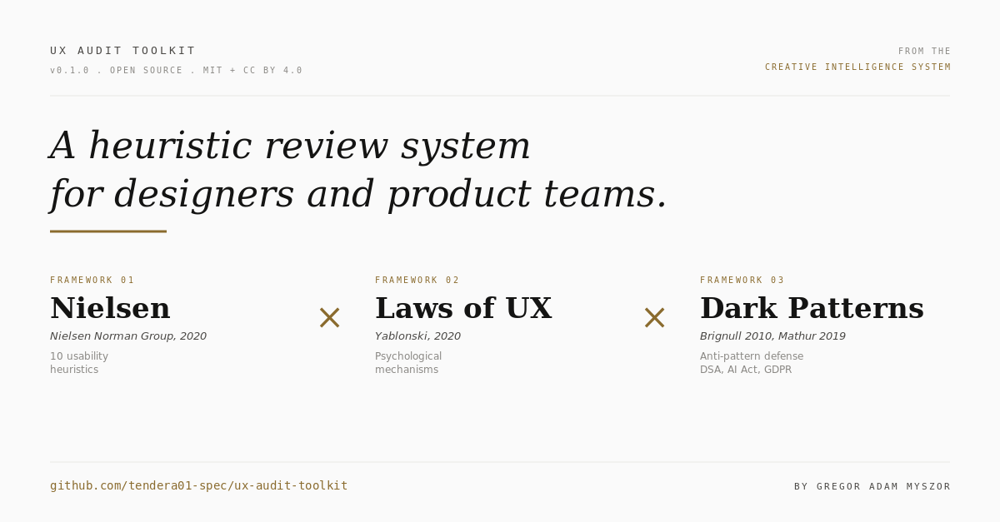

# accessibility-audit-toolkit



**Accessibility-Audit-Skills für Claude Code, Cowork und vergleichbare AI-Assistenten. Open Source.**


# ux-audit-toolkit

**UX-Audit-Skills für Claude Code, Cowork und vergleichbare AI-Assistenten. Open Source.**

Drei Skills plus UX-Knowledge-Base plus Onboarding-Wizard. Liefert heuristische UX-Reviews nach Nielsen-Heuristiken, Laws of UX und Dark-Pattern-Taxonomie. Compliance-aware (DSA Art. 25, AI Act, GDPR).

**Version:** 0.1.0
**License:** MIT (Code) plus CC BY 4.0 (Knowledge)
**Plugin-Format:** Cowork/Claude-Code-kompatibel, optional Standalone-Install

> **Companion-Plugin:** Für WCAG 2.2 AA Audits und BFSG/EAA-Compliance-Checks: [`accessibility-audit-toolkit`](https://github.com/tendera01-spec/accessibility-audit-toolkit). Beide Plugins lassen sich parallel betreiben.

---

## Was ist drin

### Skills

| Skill | Was er macht |
|-------|--------------|
| `ux-review` | Heuristik-Audit nach Nielsen + Laws of UX + Dark-Pattern-Taxonomie |
| `audit-wizard` | Interaktiver Step-by-Step-UX-Audit-Flow mit Zwischenständen |
| `ux-toolkit-onboard` | Onboarding-Wizard für neue User. Führt durch Setup, Demo-Audit, Workflow-Konfiguration |

### Knowledge-Base

- Nielsen-Heuristiken (10 Stück, mit Verstoßbeispielen)
- Laws of UX (ca. 25 Laws, mit Mechanismen und Anwendung)
- Dark Patterns (Brignull-Taxonomie plus Mathur 2019, mit EU-Compliance-Bezug)
- 5er Kunden-Grundprinzipien (für Workshops und Briefings)

---

## Installation

Zwei Wege.

### Option A: Cowork-Plugin (empfohlen für Cowork-User)

```bash
git clone https://github.com/tendera01-spec/ux-audit-toolkit.git
cd ux-audit-toolkit
./build-plugin.sh
```

Output: `dist/ux-audit-toolkit-0.1.0.plugin`

Plugin per Doppelklick in Cowork öffnen, Install bestätigen. Skills sind danach in jeder Session verfügbar.

Alternativ über Claude Code:

```bash
claude plugin install dist/ux-audit-toolkit-0.1.0.plugin
```

### Option B: Standalone-Install via Python-Wizard

```bash
git clone https://github.com/tendera01-spec/ux-audit-toolkit.git
cd ux-audit-toolkit
python3 install.py
```

Optionen:

```bash
python3 install.py --all                       # alle Skills automatisch
python3 install.py --platform claude-code      # Plattform manuell
python3 install.py --target ~/my-workspace     # Manuelles Ziel-Verzeichnis
python3 install.py --dry-run --all             # Dry-Run (zeigt was passieren würde)
```

---

## Quickstart

Nach der Installation triggert der Onboarding-Wizard:

```
"setup" oder "ux toolkit onboard"
```

Oder direkt einen Audit starten:

| Eingabe | Skill |
|---------|-------|
| "Review meinen Screen" | ux-review |
| "Dark-Pattern-Check für Checkout" | ux-review |
| "Heuristik-Audit nach Nielsen" | ux-review |
| "Geführter UX-Audit Schritt für Schritt" | audit-wizard |
| "Hilf mir beim Einstieg" | ux-toolkit-onboard |

---

## Output-Beispiel

```
## UX-Review Checkout-Flow

Kontext: B2C E-Commerce, Mobile-First

Kritisch:
- [Hidden Costs] Versandkosten erscheinen erst auf Step 4 von 5.
  Fix: Schätzung schon im Warenkorb. (Nielsen H1 + UCPD-Risiko)

Hoch:
- [Hick's Law] 9 Payment-Optionen gleichrangig dargestellt.
  Fix: Top 3 prominent, Rest unter Toggle.

Mittel:
- [H4 Konsistenz] CTA-Farben wechseln zwischen Steps.
  Fix: Design-Token für Primary-CTA durchsetzen.
```

---

## Plugin entwickeln und bauen

```bash
./build-plugin.sh --check       # nur Validierung
./build-plugin.sh               # vollständiger Build
./build-plugin.sh --clean       # dist/ leeren
```

Was der Build prüft: Manifest, Pflicht-Files, Skill-Frontmatter, Em-Dashes.

Output: `dist/ux-audit-toolkit-<version>.plugin` plus Symlink.

---

## Was dieses Toolkit NICHT macht

- Accessibility-Audits (WCAG, BFSG) → separates Plugin [`accessibility-audit-toolkit`](https://github.com/tendera01-spec/accessibility-audit-toolkit)
- User-Tests mit echten Nutzern
- Rechtsberatung
- Performance- oder Security-Audits

---

## Frameworks und Quellen

- Nielsen, J. (2020). 10 Usability Heuristics for User Interface Design. NN/g.
- Yablonski, J. (2020). Laws of UX. O'Reilly. https://lawsofux.com
- Brignull, H. (2010). Deceptive Design. https://www.deceptive.design
- Mathur, A. et al. (2019). Dark Patterns at Scale. ACM CSCW.
- EU (2022). Digital Services Act, Verordnung (EU) 2022/2065.
- EU (2024). AI Act, Verordnung (EU) 2024/1689.
- EU (2016). DSGVO, Verordnung (EU) 2016/679.

Originalquellen jeweils nach ihren Lizenzen frei zugänglich. Knowledge-Files in diesem Repo sind eigene Zusammenfassungen und Arbeitsmaterialien, CC BY 4.0.

---

## Beitragen

Pull Requests willkommen. Mehr in `CONTRIBUTING.md`.

---

## Roadmap

- v0.2: Englische Übersetzung aller Knowledge-Files
- v0.3: Cognitive Biases Knowledge-Domain
- v0.4: Persuasive Design Patterns
- v1.0: Marketplace-Listing

---

## Wer steht dahinter

Initial gebaut von einem Strategic Design Director, der UX seit 20+ Jahren macht. Whitelabeled OSS-Version eines internen Audit-Systems.
